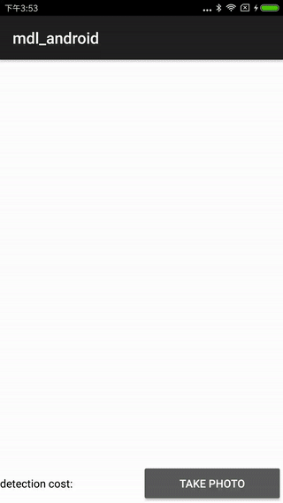

# Paddle-Mobile

The development of new version folder is fluid.

MDL renamed the paddle-mobile and move to PaddlePaddle org. We will release a lite version of the paddle fluid for mobile device. 

# Mobile-deep-learning（MDL） 

 

#### Free and open source mobile deep learning framework, deploying by Baidu.

This research aims at simply deploying CNN on mobile devices, with low complexity and high speed. 
It supports calculation on iOS GPU, and is already adopted by Baidu APP.

* Size: 340k+ (on arm v7)
* Speed: 40ms (for iOS Metal GPU Mobilenet) or 30 ms (for Squeezenet)

* 2018.01.24 arm v7a 加入了cpu缓存预充。gemm升级为纯汇编版本。
* 2018.01.24 Arm v7a joined the CPU cache preload. Gemm upgraded to a assembly version.

百度研发的移动端深度学习框架，致力于让卷积神经网络极度简单的部署在手机端。目前正在手机百度内运行。支持iOS gpu计算。体积小，速度快。

* 体积 armv7 340k+
* 速度 iOS GPU mobilenet 可以达到 40ms、squeezenet 可以达到 30ms

## Getting Started
#### Showcase




#### Be all eagerness to see it 
If you want to run the demo first, or just use it quickly, without understanding implementation details, you can just scan the QR code, install the compiled apk/ipa file.

#### 先睹为快
如果你想先运行demo试试效果。或者你仅仅是想快速用起来，而不关心CNN细节实现。我们已经为您编译好了安装文件, 直接扫码安装即可。

[Android-Googlenet](http://gss0.baidu.com/9rkZbzqaKgQUohGko9WTAnF6hhy/mms-res/graph/mobile-deep-learning/Android/mdl_demo.4493eea5.apk):


If you want to know about the source code, please keep going. The source code is located at /examples.

如果你想看demo源码实现可以往下看。它位于examples目录。
## Run the examples

1. Cloning of the project.
2. Install the apk\ipa file or import to the IDE.
3. Run it.


## Develop or use requirements
- Installing NDK for android. 
- Installing Cmake. 
- [Android NDK CMake Document](https://developer.android.google.cn/ndk/guides/cmake.html)
- Installing Protocol Buffers. 

## How to use MDL lib

#### Runing test on the OSX or Linux

MDL theoretically can run on Linux system，The MDL can only run on the MAC now, you need to do to fine tune can be run on Linux. Welcome to contribute code.
```
# mac or linux:

./build.sh mac

cd build/release/x86/build

./mdlTest
```
#### Using MDL lib in your project

```
#android 
Copy so file to your project. According to the example of writing your code.
```

```
#ios
The example code is your code.
```

#### [Help for Mac.md](Help-for-Mac.md)

#### Enable multi-thread in MDL lib
```
# After a Net instance in MDL is created, you could set its thread numbers for execution like this.
net->set_thread_num(3); # Now MDL is tuned to run in 3 parallel threads.
```

## Development

#### Compile the MDL source for android

```
# android:
# prerequisite: install ndk from google

./build.sh android

cd build/release/armv-v7a/build

./deploy_android.sh

adb shell

cd /data/local/tmp

./mdlTest
```

#### Compile the MDL source for iOS

```
# ios:
# prerequisite: install xcode from apple

./build.sh ios

copy ./build/release/ios/build/libmdl-static.a to your iOS project

```

## Model Conversion

MDL needs compatible models to work with. To get a MDL compatible model, you can convert a model trained by other deep learning tools to MDL model using our scripts.

We highly suggest using [PaddlePaddle](https://github.com/PaddlePaddle/Paddle) model. 

#### Converting PaddlePaddle model to mdl format

Paddlepaddle model can be converted to MDL model

```
# Environmental requirements 
# paddlepaddle
cd tools/python
python paddle2mdl.py
```

#### Converting caffemodel to mdl format

```
#Convert model.prototxt and model.caffemodel to model.min.json and data.min.bin that mdl use

./build.sh mac
cd ./build/release/x86/tools/build

# copy your model.prototxt and model.caffemodel to this path

./caffe2mdl model.prototxt model.caffemodel

# the third para is optional, if you want to test the model produced by this script, provide color value array of an image as the third parameter ,like this:

./caffe2mdl model.prototxt model.caffemodel data

# the color value should in order of rgb,and transformed according to the model.

# then you will get a new data.min.bin with test data inside 


# after this command, model.min.json data.min.bin will be created in current 
# some difference step you need to do if you convert caffe model to iOS GPU format
# see this:
open iOS/convert/iOSConvertREADME.md

```
[iOSConvertREADME](https://github.com/baidu/mobile-deep-learning/blob/master/iOS/convert/iOSConvertReadme.md)

## Features
* One-button deployment. You can switch it to iOS or android by change parameters.
* Support MobileNet and Squeezenet on iOS GPU.
* Stablely running on MobileNet, GoogLeNet v1 and Squeezenet.
* With extremely tiny size (~4M), without dependency on third-party libraries.
* Provide quantization scripts, directly support the transform from 32-bit float to 8-bit uint.
* We will continue to optimize the ARM platform according to the online and offline communication with ARM related algorithm team.
* NEON usage covers all aspects of convolution, normalization, pooling, and so on.
* Assembly optimizations are optimized for register assembler operations.
* Loop unrolling, to expand the performance, reduce unnecessary CPU consumption, all expand the judgment operation.
* Forward a large number of heavy computing tasks to the overhead process.

## 特征
* 一键部署，脚本参数就可以切换ios或者android
* 支持iOS  gpu运行MobileNet、squeezenet模型
* 已经测试过可以稳定运行MobileNet、GoogLeNet v1、squeezenet、ResNet-50模型
* 体积极小，无任何第三方依赖。纯手工打造。
* 提供量化函数，对32位float转8位uint直接支持，模型体积量化后4M上下
* 与ARM相关算法团队线上线下多次沟通，针对ARM平台会持续优化
* NEON使用涵盖了卷积、归一化、池化所有方面的操作
* 汇编优化，针对寄存器汇编操作具体优化
* loop unrolling 循环展开，为提升性能减少不必要的CPU消耗，全部展开判断操作
* 将大量繁重的计算任务前置到overhead过程

## TODO
* Android GPU implementation
* Converting Tensorflow Model to MDL
* Support Faster RCNN

## License
This project is licensed under the MIT License - see the [LICENSE](LICENSE) file for details

MDL使用的是宽松的MIT开源协议。


