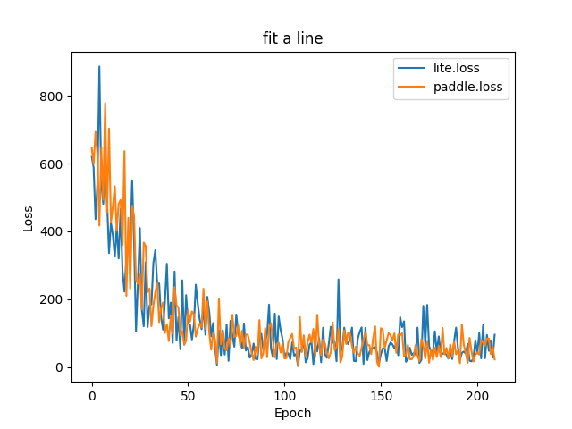

# C++ Train Demo

## Introduction

我们都知道，PaddleLite可以做移动端预测，事实上PaddleLite支持在移动端做模型训练。本文给出使用PaddleLite做训练的例子，这一例子对应的任务是“波士顿房价预测”，又称作“fit-a-line”。
  
你可以通过book库中的
[文档](https://paddlepaddle.org.cn/documentation/docs/zh/user_guides/simple_case/fit_a_line/README.cn.html)
和
[源码](https://github.com/PaddlePaddle/book/tree/develop/01.fit_a_line)
进一步了解“波士顿房价预测”这一任务的定义及其建模过程，
其使用线性回归（Linear Regression）
模型做建模。本文主要介绍如何将其迁移至Paddle-Lite进行训练。

## Requirements

- 一部安卓手机，用于运行训练程序
- 装了Paddle (version >= 1.7.0) 的python

## Quick start

### Step1 build paddle-lite

请按照paddle-lite官方文档的教程编译full_publish的paddle-lite lib。以Linux上编译为例，其具体的命令为：

```shell
## 配置环境
wget -c https://mms-res.cdn.bcebos.com/cmake-3.10.3-Linux-x86_64.tar.gz --no-check-certificate
tar xzf cmake-3.10.3-Linux-x86_64.tar.gz
export PATH=${PWD}'/cmake-3.10.3-Linux-x86_64/bin':$PATH

wget https://dl.google.com/android/repository/android-ndk-r17c-linux-x86_64.zip
unzip android-ndk-r17c-linux-x86_64.zip
export NDK_ROOT=/opt/android-ndk-r17c

## 编译
git clone https://github.com/PaddlePaddle/Paddle-Lite.git
cd Paddle-Lite
./lite/tools/build.sh \
  --arm_os=android \
  --arm_abi=armv7 \
  --build_extra=ON \
  --arm_lang=gcc \
  --android_stl=c++_static \
  --build_train=ON full_publish
```

产物:

```shell
Paddle-Lite/build.lite.android.armv7.gcc/inference_lite_lib.android.armv7/cxx/lib/libpaddle_full_api_shared.so
```

### Step2 编译lr_trainer

```shell
cd Paddle-Lite/lite/demo/cxx/train_demo/cplus_train/
sh run_build.sh /path/to/your/Paddle-Lite/build.lite.android.armv7.gcc/ /path/to/your/android-ndk-r17c
```

产物:
```shell
bin/
`-- demo_trainer
```

### Step3 download model and run it!

在你的笔记本电脑上，用usb连接到手机，开启开发者模式，在任意目录下执行：

```shell
local_path=/data/local/tmp/linear_regression
adb shell "mkdir "${local_path}

# download model and push to mobile
wget http://paddle-tar.bj.bcebos.com/paddle-lite/lite_lr_model.tar.gz
tar -zxvf lite_lr_model.tar.gz
adb push lite_lr_model/housing.data ${local_path}
adb push lite_lr_model/model_dir ${local_path}

# push lib and executable file to moblie
adb push libpaddle_full_api_shared.so ${local_path}
adb push demo_trainer ${local_path}
adb shell chmod +x ${local_path}/demo_trainer

# run it!
adb shell "export LD_LIBRARY_PATH="${local_path}" && export LIBRARY_PATH="${local_path}" && cd "${local_path}" && ./demo_trainer true"
```

期望结果：

```
sample 0: Loss: 564.317
sample 1: Loss: 463.9
sample 2: Loss: 1197.54
sample 3: Loss: 1093.83
sample 4: Loss: 1282.76
sample 5: Loss: 792.097
sample 6: Loss: 491.776
sample 7: Loss: 698.496
sample 8: Loss: 248.445
sample 9: Loss: 325.135
```

## 更多细节
上面提到的模型是直接下载得到的，如果你想自己生成，可以执行以下命令：

```shell
git clone https://github.com/PaddlePaddle/Paddle-Lite.git
cd Paddle-Lite/lite/demo/cxx/train_demo/
python train.py --save_model
```

产物：

```shell
model_dir/
|-- fc_0.b_0
|-- fc_0.w_0
|-- learning_rate_0
`-- __model__

md5sum fc_0.w_0: 2c7b3649b2a9cf7bcd19f8b256ce795d
```

如果你想生成自己的模型用于训练，可以参考`train.py`中保存模型的方式。

## 与Paddle训练结果做校对

### 前10个Loss值

为了验证paddle与lite的一致性，我们控制模型参数一致、数据一致、batch size = 1的情况下，训练10个batch， 记录了二者的loss值。

python + paddle 命令:

```shell
  fluid train.py --num_steps=10 --batch_size=1
```

python + paddle 结果:

```shell
Train cost, Step 0, Cost 564.317017
Train cost, Step 1, Cost 463.900238
Train cost, Step 2, Cost 1197.537354
Train cost, Step 3, Cost 1093.833008
Train cost, Step 4, Cost 1282.760254
Train cost, Step 5, Cost 792.097351
Train cost, Step 6, Cost 491.775848
Train cost, Step 7, Cost 698.496033
Train cost, Step 8, Cost 248.444885
Train cost, Step 9, Cost 325.135132
```

c++ 与 paddle-lite命令：
```
./demo_trainer true
```

c++ 与 paddle-lite结果：
```
sample 0: Loss: 564.317
sample 1: Loss: 463.9
sample 2: Loss: 1197.54
sample 3: Loss: 1093.83
sample 4: Loss: 1282.76
sample 5: Loss: 792.097
sample 6: Loss: 491.776
sample 7: Loss: 698.496
sample 8: Loss: 248.445
sample 9: Loss: 325.135
```

### Loss 曲线

控制训练时的batch size为20，每个epoch对训练数据做全局shuffle，训练100个epoch后，paddle和lite的loss曲线对比如下。



如果想复现上述效果，paddle+python的运行命令为：

```
git clone https://github.com/PaddlePaddle/book.git
cd book/01.fit_a_line
python train.py
```

lite + c++的运行命令为：
```
./demo_trainer false
```
