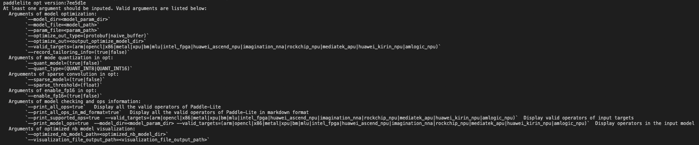
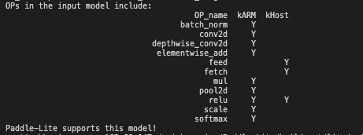
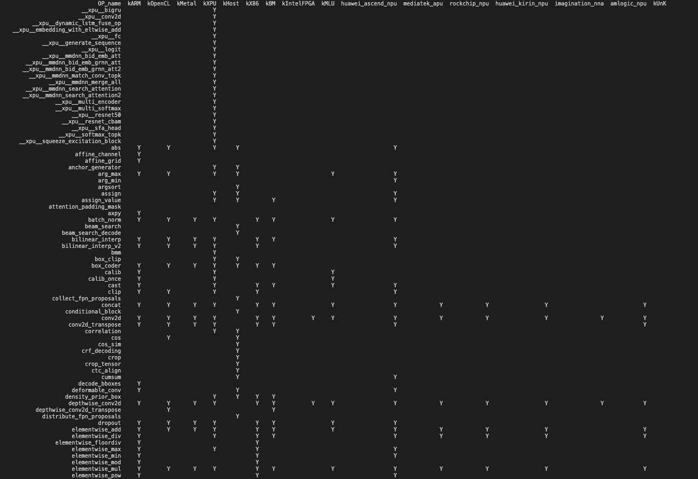
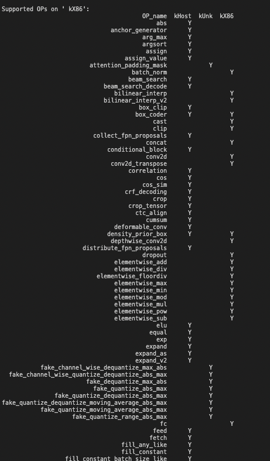

## 使用可执行文件 opt

opt 是 x86 平台上的可执行文件，需要在 PC 端运行：支持 Linux 终端和 Mac 终端。

### 1、帮助信息

执行 opt 时不加入任何输入选项，会输出帮助信息，提示当前支持的选项：

```bash
 ./opt
```
> **注意：** 如果提醒 opt 没有执行权限，请先通过`chmod +x ./opt`命令为文件添加可执行权限。



### 2、功能一：转化模型为 Paddle Lite 格式
opt 可以将 PaddlePaddle 的部署模型格式转化为 Paddle Lite 支持的模型格式，期间执行的操作包括：

- 将 protobuf 格式的模型文件转化为 naive_buffer 格式的模型文件，有效降低模型体积
- 执行“量化、子图融合、混合调度、 Kernel 优选”等图优化操作，提升其在 Paddle Lite 上的运行速度、内存占用等效果

模型优化过程：

（1）准备待优化的 PaddlePaddle 模型

PaddlePaddle 模型有两种保存格式：
   Combined Param ：所有参数信息保存在单个文件`params`中，模型的拓扑信息保存在`__model__`文件中。


   Seperated Param：参数信息分开保存在多个参数文件中，模型的拓扑信息保存在`__model__`文件中。


(2) 终端中执行`opt`优化模型
**使用示例**：转化`mobilenet_v1`模型

```shell
./opt --model_dir=./mobilenet_v1 --valid_targets=arm --optimize_out_type=naive_buffer --optimize_out=mobilenet_v1_opt
```
以上命令可以将`mobilenet_v1`模型转化为在 arm 硬件平台执行的、 naive_buffer 格式的 Paddle Lite 支持模型，优化后的模型文件为`mobilenet_v1_opt.nb`，转化结果如下图所示：


(3) **更详尽的转化命令**总结：

```shell
./opt \
    --model_dir=<model_param_dir> \
    --model_file=<model_path> \
    --param_file=<param_path> \
    --optimize_out_type=(protobuf|naive_buffer) \
    --optimize_out=<output_optimize_model_dir> \
    --valid_targets=(arm|opencl|x86|x86_opencl|npu) \
    --record_tailoring_info =(true|false) \
    --quant_model=(true|false) \
    --quant_type=(QUANT_INT8|QUANT_INT16)
```

| 选项         | 说明 |
| ------------------- | ------------------------------------------------------------ |
| --model_dir         | 待优化的 PaddlePaddle 模型（非 combined 形式）的路径。 |
| --model_file        | 待优化的 PaddlePaddle 模型（ combined 形式）的网络结构文件路径。 |
| --param_file        | 待优化的 PaddlePaddle 模型（ combined 形式）的权重文件路径。 |
| --optimize_out_type | 输出模型类型，目前支持两种类型： protobuf 和 naive_buffer ，默认为 naive_buffer 。其中 naive_buffer 是一种更轻量级的序列化/反序列化实现。若您需要在mobile端执行模型预测，请将此选项设置为 naive_buffer。 |
| --optimize_out      | 优化模型的输出路径。                                         |
| --valid_targets     | 指定模型在特定的硬件平台上执行，默认为 arm 。目前可支持 arm、 opencl、 x86、 metal、 xpu、 bm、 mlu、 intel_fpga、 huawei_ascend_npu、imagination_nna、 rockchip_npu、 mediatek_apu、 huawei_kirin_npu、 amlogic_npu，可以同时指定多个硬件平台(以逗号分隔，优先级高的在前)，Model Optimize Tool 将会自动选择最佳方式。如果需要支持华为麒麟 NPU ，应当设置为" huawei_kirin_npu , arm "。 |
| --record_tailoring_info | 当使用 [根据模型裁剪库文件](../../source_compile/library_tailoring.html) 功能时，则设置该选项为 true ，以记录优化后模型含有的 kernel 和 OP 信息，默认为 false 。 |
| --quant_model       | 设置是否使用 opt 中的动态离线量化功能。 |
| --quant_type        | 指定 opt 中动态离线量化功能的量化类型，可以设置为 QUANT_INT8 和 QUANT_INT16 ，即分别量化为 int8 和 int16 。量化为 int8 对模型精度有一点影响，模型体积大概减小4倍。量化为 int16 对模型精度基本没有影响，模型体积大概减小2倍。|

* 如果待优化的 paddle 模型是非 combined 形式，请设置`--model_dir`，忽略`--model_file`和`--param_file`。
* 如果待优化的 paddle 模型是 combined 形式，请设置`--model_file`和`--param_file`，忽略`--model_dir`。
* `naive_buffer`的优化后模型为以`.nb`名称结尾的单个文件。
* `protobuf`的优化后模型为文件夹下的`model`和`params`两个文件。将`model`重命名为`__model__`用[ Netron ](https://lutzroeder.github.io/netron/)打开，即可查看优化后的模型结构。
* 删除`prefer_int8_kernel`的输入参数，`opt`自动判别是否是量化模型，进行相应的优化操作。
* `opt`中的动态离线量化功能和`PaddleSlim`中动态离线量化功能相同，`opt`提供该功能是为了用户方便使用。

### 3、功能二：统计算子信息、判断模型是否支持

opt 可以统计并打印出模型中的算子信息、判断 Paddle Lite 是否支持该模型，并可以打印出当前 Paddle Lite 的算子支持情况。

（1）使用 opt 统计模型中算子信息

下面命令可以打印出 mobilenet_v1 模型中包含的所有算子，并判断在硬件平台`valid_targets`下 Paddle Lite 是否支持该模型

`./opt --print_model_ops=true  --model_dir=mobilenet_v1 --valid_targets=arm`



其中`kHost`上支持的算子是纯 C++ 实现的，不引用其他任何第三方计算库的算子，当在用户定义的`valid_targets`上找不到算子时，便会在`kHost`上寻找对应的算子。

（2）使用 opt 打印当前 Paddle Lite 支持的算子信息

`./opt --print_all_ops=true`

以上命令可以打印出当前 Paddle Lite 支持的所有算子信息，包括 OP 的数量和每个 OP 支持哪些硬件平台：



（3）使用 opt 打印当前 Paddle Lite 在不同硬件平台上支持的算子信息

`./opt --print_supported_ops=true  --valid_targets=x86`

以上命令可以打印出当`valid_targets=x86`时 Paddle Lite 支持的所有 OP ：



其中`KUnk`上支持的算子是量化相关的算子。

### 4、功能三：nb 模型可视化
  opt 工具可以加载优化之后的 naive_buffer 模型，并生成可视化 dot 文件。可视化命令为：

```shell
  ./opt --optimized_nb_model_path=<optimized_nb_model_file_path> \
        --visualization_file_output_path=<visualization_file_output_path> \
```

| 选项         | 说明 |
| ------------------- | ------------------------------------------------------------ |
| --optimized_nb_model_path         | 优化之后的 nb 模型文件路径。 |
| --visualization_file_output_path  | 可视化 dot 文件的保存路径 |

如想查看优化之后的模型`mobilenet_v1_opt.nb`结构, 并将可视化 dot 文件保存在当前路径下，执行下面命令：

`./opt --optimized_nb_model_path=./mobilenet_v1_opt.nb --visualization_file_output_path=.`

执行结果如下所示：


执行生成了 Blcok_0.dot 文件，再执行 dot 命令，便可生成 pdf，png 等文件，如从 Blcok_0.dot 生成 pdf 文件：

`dot Block_0.dot -Tpdf -o Block_0.pdf`


打开生成的 pdf 文件即可查看模型的结构。

> **注意：** 请确保当前环境已经安装有 dot 可执行命令，可通过`dot -V`查看确认，如果当前环境没有安装 dot 命令，可以将 dot 文件中的内容复制到[ webgraphviz ](http://www.webgraphviz.com/)  进行查看。
