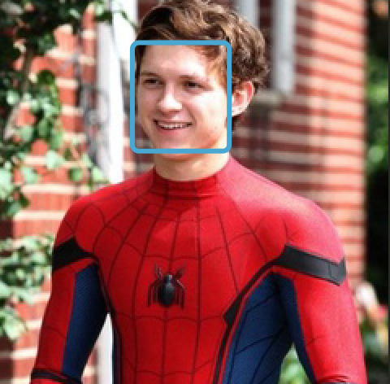

[中文版](./README_cn.md)
# PaddleJS Examples

Baidu paddlejs uses the ready-made JavaScript model or transforms the paddle model to run in the browser.

## Demonstration

At present, tiny Yolo model can run within 30ms for web project, which is enough for general real-time scenarios.

## Browser coverage

* PC: Chrome
* Mac: Chrome
* Android: Baidu App and QQ Browser

## Building deployment

```bash
cd web                        # Go to root
npm i                         # Installation dependency
mkdir dist                    # Create resource directory
cd dist                       # Enter resource directory
git clone https://github.com/DerekYangMing/Paddle-Web-Models.git # Get models
mv Paddle-Web-Models/separablemodel .                            # Move the model to the designated location
cd ..                         # Root directory
npm run tinyYolo              # run tinyYolo 
```

## Preview

1. Open url: https://localhost:端口号/
2. Click the upload picture button。

## Result


